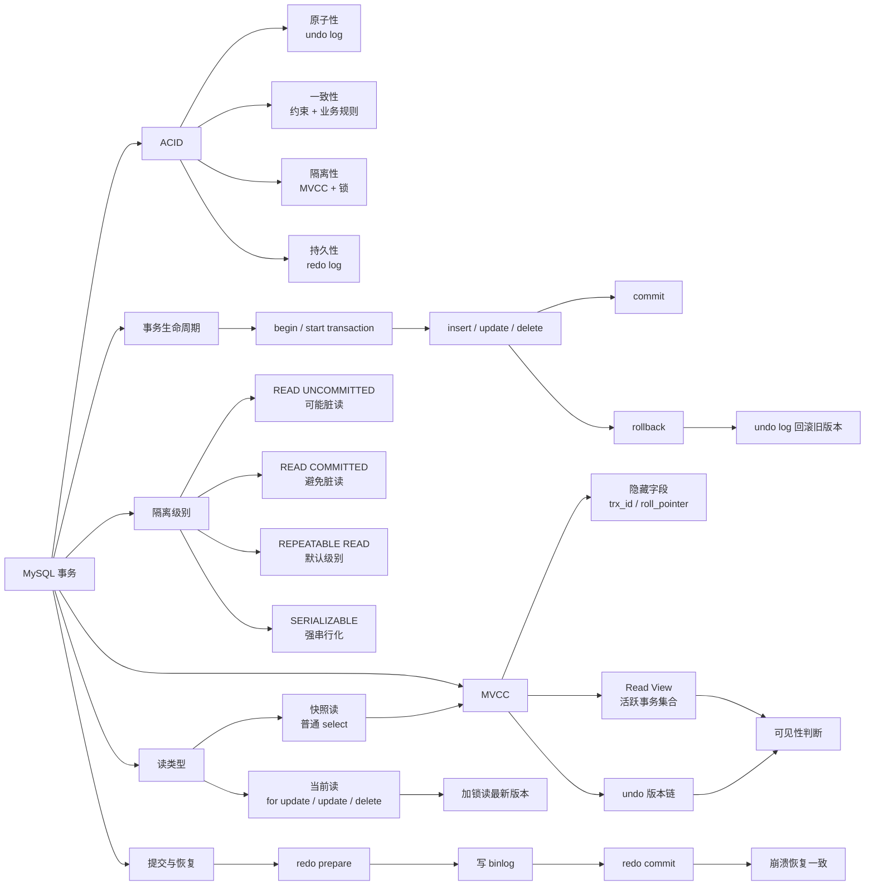
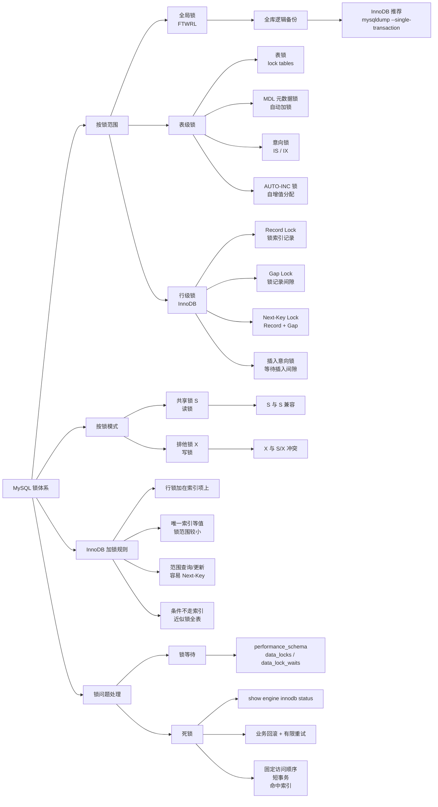
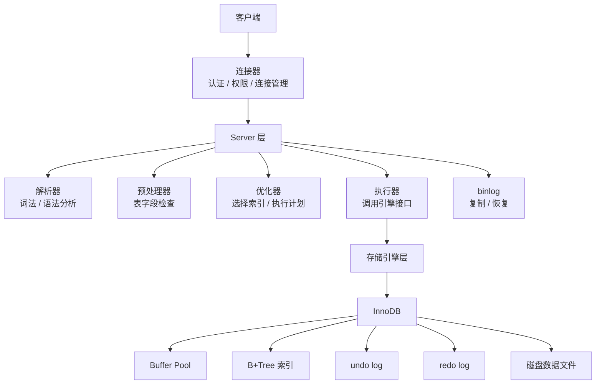

# MySQL 学习笔记（按专题整理）

> 目标：从“会写 SQL”进阶到“能解释为什么快/慢、稳/不稳”。

## 一、基础篇

### 1. MySQL 执行流程

一条 SQL 从客户端发送到 MySQL Server 后，大致经过以下流程：

客户端 -> 连接器 -> 查询缓存（MySQL 8.0 已废弃） -> 解析器 -> 预处理器 -> 优化器 -> 执行器 -> 存储引擎

#### 1.1 连接器

连接器负责客户端连接、身份认证、权限校验和连接管理。

常用命令：

```sql
show variables like 'max_connections';
```

`max_connections` 表示 MySQL 允许的最大连接数。连接过多可能报错：

```text
Too many connections
```

#### 1.2 查询缓存

MySQL 8.0 已移除查询缓存。MySQL 8.0 之前，查询缓存以 key-value 保存在内存：

- key = SQL 语句
- value = 查询结果

相关参数：

```sql
show variables like 'query_cache_type';
```

常见值：

- `OFF`：关闭查询缓存
- `ON`：开启查询缓存
- `DEMAND`：按需使用查询缓存

查询缓存的问题是：只要表数据发生变更，该表相关缓存就会失效；高并发写入场景收益通常较低。

#### 1.3 解析 SQL

解析分两个阶段：

- 词法分析：识别关键字和标识符
- 语法分析：判断是否符合 MySQL 语法规则

示例 SQL：

```sql
select * from user where id = 1;
```

若语法错误，会直接返回：

```text
You have an error in your SQL syntax
```

#### 1.4 预处理器

预处理器主要负责：

- 检查表是否存在
- 检查字段是否存在
- 检查语义是否合法
- 展开 `select *`

示例：

```sql
select name from user;
```

会检查 `user` 表是否存在、`name` 字段是否存在。

#### 1.5 优化器

优化器负责生成执行计划，决定使用哪种执行方式，例如：

- 使用哪个索引
- 表连接顺序
- 是否全表扫描
- 是否使用覆盖索引
- 是否使用索引下推

查看执行计划：

```sql
explain select * from user where id = 1;
```

#### 1.6 执行器

执行器根据优化器生成的执行计划调用存储引擎接口，获取数据并返回结果。常见执行方式包括：

- 主键索引查询
- 二级索引查询
- 回表查询
- 全表扫描
- 覆盖索引
- 索引下推

---

### 2. 一行记录是如何存储的

#### 2.1 MySQL 表相关文件

查看数据目录：

```sql
show variables like 'datadir';
```

MySQL 5.7 常见文件：

- `db.opt`
- `*.frm`
- `*.ibd`

说明：

- `db.opt`：数据库默认字符集和排序规则
- `*.frm`：表结构定义
- `*.ibd`：InnoDB 表数据与索引

MySQL 8.0 之后：

- 废弃 `*.frm`，表结构信息存储在数据字典中
- 常见文件仍有 `*.ibd`

注：文件扩展名是 `*.ibd`，不是 `*.idb`。

#### 2.2 InnoDB 存储结构

InnoDB 逻辑存储结构：

表空间 -> 段（Segment）-> 区（Extent）-> 页（Page）-> 行（Row）

页（Page）是 InnoDB 管理磁盘的基本单位，默认大小：

- `16KB`

查看页大小：

```sql
show variables like 'innodb_page_size';
```

区（Extent）由连续页组成，默认：

- 1 个区 = 64 个页
- 1 个页 = 16KB
- 1 个区 = 1MB

段（Segment）用于组织不同类型的数据，例如：

- 数据段
- 索引段
- 回滚段

---

### 3. InnoDB 行格式

常见行格式：

- `Redundant`
- `Compact`
- `Dynamic`
- `Compressed`

常用的是 `Compact` 和 `Dynamic`；MySQL 5.7/8.0 默认一般是 `Dynamic`。

查看默认行格式：

```sql
show variables like 'innodb_default_row_format';
```

#### 3.1 Compact 行格式

一行记录大致由以下部分组成：

- 变长字段长度列表
- NULL 值列表
- 记录头信息
- 隐藏字段
- 真实字段数据

结构示意：

```text
| 变长字段长度列表 | NULL值列表 | 记录头信息 | row_id | trx_id | roll_pointer | 真实字段 |
```

隐藏字段说明：

- `row_id`：隐藏主键（仅在无主键且无唯一非空索引时生成）
- `trx_id`：最近一次修改该记录的事务 ID
- `roll_pointer`：回滚指针，指向 undo log

注意：如果表有主键，不会生成 `row_id`。

记录头信息常见字段：

- `delete_mask`：标记记录是否被删除
- `next_record`：指向下一条记录
- `record_type`：记录类型

---

### 4. VARCHAR 和行大小限制

MySQL 单行记录存在大小限制。除 `TEXT`、`BLOB` 等大对象外，其他字段一行总长度不能超过约：

- `65535` 字节

注意：这是 MySQL Server 层限制，不是 InnoDB 单页 `16KB` 的限制。

`varchar(n)` 中 `n` 的含义是字符数，不是字节数。不同字符集下一个字符占用字节不同：

- `ascii`：1 字节
- `utf8`：最多 3 字节
- `utf8mb4`：最多 4 字节

示例：

```text
varchar(100) 在 utf8mb4 下最多可占 400 字节
```

行大小大致包含：

- 非大对象字段字节数
- 变长字段长度列表
- NULL 值列表
- 记录头信息
- 隐藏字段

可粗略理解为：

```text
上述总和 < 65535 字节
```

---

### 5. 行溢出

InnoDB 页默认大小 16KB。若一行数据过大，可能无法完整放入一个页，此时会发生行溢出（部分数据放入溢出页）。

`Compact` 行格式：

- 当前页存放：部分真实数据 + 溢出页地址

`Dynamic` / `Compressed` 行格式：

- 当前页尽量只存放：溢出页地址
- 真实数据主要放在溢出页

---

## 二、索引篇

### 1. 索引分类

#### 1.1 按数据结构分类

- B+ 树索引
- Hash 索引
- Full-text 全文索引

InnoDB 默认使用的是 B+ 树索引。

#### 1.2 按物理存储分类

- 聚簇索引
- 二级索引

#### 1.3 按字段特性分类

- 主键索引
- 唯一索引
- 普通索引
- 前缀索引
- 全文索引

#### 1.4 按字段个数分类

- 单列索引
- 联合索引

---

### 2. 聚簇索引和二级索引

#### 2.1 聚簇索引

InnoDB 中，聚簇索引叶子节点存储完整行数据。通常主键索引就是聚簇索引：

- 主键索引叶子节点 = 完整行数据

如果表没有主键：

1. 优先选择一个唯一非空索引作为聚簇索引
2. 若不存在，自动生成隐藏 `row_id` 作为聚簇索引

#### 2.2 二级索引

二级索引叶子节点存储：

- 索引字段值 + 主键值

若查询字段无法由二级索引覆盖，需要根据主键值回到聚簇索引取完整行，这个过程叫回表。

---

### 3. InnoDB 和 MyISAM 索引区别

`InnoDB`：

- 聚簇索引叶子节点存完整行
- 二级索引叶子节点存主键值

`MyISAM`：

- B+ 树叶子节点存数据文件物理地址
- 索引和数据分开存储

---

### 4. B+ 树相关数据结构

常见数据结构包括：

- 二叉查找树
- 平衡二叉树（AVL）
- 红黑树
- B 树
- B+ 树

InnoDB 选择 B+ 树主要因为：

- 树更矮胖，磁盘 IO 次数更少
- 非叶子节点仅存键值和指针，可容纳更多分支
- 叶子节点通过链表连接，范围查询更高效
- 数据都在叶子节点，查询性能更稳定

---

### 5. 为什么常说单表不要超过 2000 万行

“单表不要超过 2000 万行”不是 MySQL 硬性限制，而是工程经验值。主要原因：

1. B+ 树层级可能增加，查询 IO 成本变高
2. 数据量越大，索引维护成本越高
3. DDL、备份、恢复、迁移成本上升
4. 大事务、慢查询、锁等待风险更高
5. Buffer Pool 命中率可能下降

是否需要分表，取决于：

- 单行大小
- 索引数量
- 查询模式
- 硬件配置
- Buffer Pool 大小
- QPS/TPS
- 业务增长速度

---

### 6. 索引优化

#### 6.1 前缀索引优化

对于长字符串字段可只索引前缀：

```sql
create index idx_email on user(email(10));
```

适用于 `varchar` / `text` 等长字段。

优点：

- 索引更小
- 查询更快（通常）
- 磁盘 IO 更低

缺点：

- 不能天然覆盖完整字段查询
- 区分度不足时效果差

#### 6.2 覆盖索引优化

若查询字段都在索引中，可避免回表。

```sql
create index idx_name_age on user(name, age);
select name, age from user where name = 'Tom';
```

该查询只扫描二级索引，不需要回表。

#### 6.3 主键最好自增

InnoDB 主键索引是聚簇索引。主键自增通常带来顺序写，插入更友好。

主键无序（如 UUID）可能导致：

- 页分裂
- 随机 IO
- 索引碎片
- 插入性能下降

通常推荐：自增 `bigint`（或趋势递增的主键方案）。

#### 6.4 索引字段尽量 `NOT NULL`

原因：

- 减少 NULL 相关比较与统计复杂度
- 避免三值逻辑带来的查询歧义
- 降低优化器额外判断开销

示例：

```sql
name varchar(64) not null default '';
age int not null default 0;
```

#### 6.5 防止索引失效

常见失效场景与优化方式：

1) 左模糊或全模糊匹配

```sql
-- 可能失效
where name like '%abc';
where name like '%abc%';

-- 可利用索引
where name like 'abc%';
```

2) 对索引字段使用函数

```sql
-- 不推荐
where date(create_time) = '2026-05-14';

-- 推荐
where create_time >= '2026-05-14 00:00:00'
  and create_time <  '2026-05-15 00:00:00';
```

3) 对索引字段做表达式计算

```sql
-- 不推荐
where age + 1 = 18;

-- 推荐
where age = 17;
```

4) 隐式类型转换

```sql
-- phone 为 varchar(20)
-- 不推荐
where phone = 13800138000;

-- 推荐
where phone = '13800138000';
```

5) 联合索引不满足最左前缀

```sql
create index idx_a_b_c on t(a, b, c);
```

通常可较好使用索引：

- `where a = 1`
- `where a = 1 and b = 2`
- `where a = 1 and b = 2 and c = 3`

效果不稳定或可能较差：

- `where b = 2`
- `where c = 3`
- `where b = 2 and c = 3`

6) `OR` 条件

```sql
where a = 1 or b = 2;
```

若其中一个条件缺少索引，容易退化为全表扫描。

---

### 7. 分页查询优化

常见分页写法：

```sql
select *
from article
where status = 1
order by create_time desc
limit 100000, 20;
```

#### 7.1 深分页为什么慢

`limit offset, size` 的问题在于：`offset` 越大，MySQL 需要先扫描并丢弃前面的 `offset` 条记录，再返回 `size` 条记录。

例如 `limit 100000, 20` 通常不是只读取 20 条，而是至少扫描 100020 条相关记录。

常见性能问题：

1. 深分页扫描成本高：页码越靠后，需要跳过的数据越多。
2. 回表成本高：如果查询列不能被索引覆盖，例如 `select *`，可能会对大量被跳过的记录回表。
3. 排序成本高：如果 `order by` 没有合适索引，可能触发 `filesort`。
4. 分页结果不稳定：只按非唯一字段排序时，例如 `order by create_time desc`，可能出现重复或漏数据。

#### 7.2 游标分页 / Keyset Pagination

适合“下一页”“加载更多”场景。

普通深分页：

```sql
select *
from article
order by id desc
limit 100000, 20;
```

优化为基于上一页最后一条记录继续查询：

```sql
select *
from article
where id < 982341
order by id desc
limit 20;
```

如果按时间排序，建议加唯一字段保证排序稳定：

```sql
select *
from article
where (create_time, id) < ('2026-05-15 10:00:00', 982341)
order by create_time desc, id desc
limit 20;
```

配套索引：

```sql
create index idx_article_time_id
on article(create_time desc, id desc);
```

核心思路：利用索引从上次位置继续向后扫描，避免跳过大量 `offset` 数据。

#### 7.3 覆盖索引先分页，再回表

如果业务必须支持跳到第 N 页，可先通过覆盖索引查出主键，再只对当前页数据回表：

```sql
select a.*
from article a
join (
    select id
    from article
    where status = 1
    order by create_time desc, id desc
    limit 100000, 20
) x on a.id = x.id
order by a.create_time desc, a.id desc;
```

配套索引：

```sql
create index idx_article_status_time_id
on article(status, create_time desc, id desc);
```

子查询只扫描索引，减少被跳过数据的回表成本；外层查询只对当前页的 20 条数据回表。

#### 7.4 建立匹配查询条件和排序的联合索引

分页 SQL 应尽量让 `where` 和 `order by` 使用同一个联合索引：

```sql
select id, title, create_time
from article
where status = 1
order by create_time desc, id desc
limit 20;
```

推荐索引：

```sql
create index idx_article_status_time_id
on article(status, create_time desc, id desc);
```

如果查询字段都在索引里，还可以进一步做到覆盖索引：

```sql
create index idx_article_cover
on article(status, create_time desc, id desc, title);
```

注意：不要为了覆盖索引盲目把很多大字段放进索引，尤其是 `text` 或很长的 `varchar` 字段。

#### 7.5 分页优化实践建议

- 优先使用游标分页，避免深分页。
- 必须跳页时，使用覆盖索引先查主键，再回表查完整数据。
- `order by` 要有稳定顺序，建议加上唯一字段，例如 `order by create_time desc, id desc`。
- 业务上限制最大可翻页深度，例如只允许访问前 100 页。
- 对慢分页 SQL 使用 `explain` 检查是否命中联合索引、是否有 `Using filesort`、是否有大量回表。

---

### 8. COUNT 计数优化

#### 8.1 `count` 的含义

`count(expr)` 统计的是 `expr` 非 `NULL` 的记录数。

#### 8.2 `count(*)` 和 `count(1)`

```sql
select count(*) from user;
select count(1) from user;
```

在 InnoDB 中两者通常性能接近，通常推荐 `count(*)`（语义更清晰）。

#### 8.3 `count(主键)`

```sql
select count(id) from user;
```

若 `id` 主键且非空，结果与 `count(*)` 一致；性能一般也接近，但不作为首选表达。

#### 8.4 `count(普通字段)`

```sql
select count(name) from user;
```

统计的是 `name` 非空数量。若字段可空，结果可能小于 `count(*)`；是否快取决于字段索引和执行计划。

#### 8.5 性能经验

通常可粗略理解为：

`count(*) ≈ count(1) >= count(主键) >= count(普通字段)`

但最终以 `EXPLAIN` 和实际压测为准。在很多场景下，优化器会优先选择更窄的二级索引来完成 `count(*)` 扫描。

---

## 三、事务篇



### 1. ACID 与 InnoDB 落地机制

- 原子性（A）：通过 `undo log` 保证，失败可回滚。
- 一致性（C）：依赖应用约束 + 引擎约束（主键、唯一键、外键、检查约束）。
- 隔离性（I）：通过 MVCC + 锁机制实现。
- 持久性（D）：通过 `redo log` + 刷盘策略保证。

记忆方式：

- `undo` 负责“回得去”
- `redo` 负责“丢不了”

### 2. 事务开启与提交流程

默认 `autocommit = 1`，每条 DML 会独立提交。显式事务示例：

```sql
begin;
update account set balance = balance - 100 where id = 1;
update account set balance = balance + 100 where id = 2;
commit;
```

异常回滚：

```sql
rollback;
```

### 3. 并发异常与隔离级别

并发异常：

- 脏读：读到未提交数据
- 不可重复读：同一事务两次读同一行结果不同
- 幻读：同一事务两次范围查询返回记录数量不同

隔离级别（InnoDB）：

- `READ UNCOMMITTED`：可能脏读
- `READ COMMITTED`：避免脏读，仍可能不可重复读
- `REPEATABLE READ`（默认）：通过 MVCC + Next-Key Lock 抑制大部分幻读
- `SERIALIZABLE`：强串行化，吞吐最低

查看当前隔离级别：

```sql
show variables like 'transaction_isolation';
```

### 4. MVCC 核心机制（面试高频）

每条记录的隐藏信息（简化理解）：

- `trx_id`：最后修改该行的事务 ID
- `roll_pointer`：指向旧版本（undo 记录）

`Read View` 关键要素：

- 当前活跃事务集合
- 最小活跃事务 ID
- 最大已分配事务 ID

通过可见性规则决定“当前事务该读哪个版本”，实现读写并发。

### 5. 快照读与当前读

- 快照读：普通 `select`，基于 MVCC，不加锁
- 当前读：读取最新版本并加锁，典型语句：
  - `select ... for update`
  - `select ... for share`（或旧语法 `lock in share mode`）
  - `update/delete/insert`

### 6. 事务提交与两阶段提交（理解版）

简化过程：

1. 写 `redo log`（prepare）
2. 写 `binlog`
3. 写 `redo log`（commit）

目的是保证崩溃恢复后，存储引擎状态与复制日志状态一致。

### 7. 实战建议

- 事务尽量短，减少锁持有时间与 undo 堆积。
- 避免事务中放耗时操作（远程调用、复杂计算、文件 IO）。
- 固定访问顺序（按主键升序）降低死锁概率。
- 扣减库存建议单 SQL 原子条件更新：

```sql
update sku set stock = stock - 1
where id = 1001 and stock > 0;
```

根据影响行数判断是否成功，再结合幂等与重试策略。

---

## 四、锁篇
参考：[MySQL 有哪些锁？](https://xiaolincoding.com/mysql/lock/mysql_lock.html)



### 1. MySQL 锁类型总览

按加锁范围划分：

- 全局锁：锁住整个实例，典型命令是 `flush tables with read lock`。
- 表级锁：锁住整张表或表元数据，包括表锁、元数据锁、意向锁、`AUTO-INC` 锁。
- 行级锁：InnoDB 支持，包括记录锁、间隙锁、临键锁、插入意向锁。

按锁模式划分：

- 共享锁（S Lock）：读锁，多个事务可同时持有。
- 排他锁（X Lock）：写锁，与其他 S/X 锁互斥。

常见兼容关系：

| 已持有 \ 请求 | S 锁 | X 锁 |
| --- | --- | --- |
| S 锁 | 兼容 | 冲突 |
| X 锁 | 冲突 | 冲突 |

---

### 2. 全局锁

全局锁会让整个数据库实例进入只读状态。

加锁：

```sql
flush tables with read lock;
```

释放：

```sql
unlock tables;
```

会话断开后，全局锁也会自动释放。

全局锁期间会阻塞：

- 数据写入：`insert`、`update`、`delete`
- 表结构变更：`alter table`、`drop table`

典型用途是全库逻辑备份，保证备份过程中库内多张表的数据处于同一个一致性状态。

缺点也很明显：备份期间业务基本只能读，不能写。数据量越大，备份耗时越久，对业务影响越明显。

InnoDB 更常用的做法是使用一致性快照备份：

```bash
mysqldump --single-transaction
```

`--single-transaction` 会在备份前开启事务，依赖 `REPEATABLE READ` + MVCC 获取一致性视图。备份过程中业务仍可写入。该方式适合 InnoDB，不适合 MyISAM 这类不支持事务的引擎。

---

### 3. 表级锁

#### 3.1 表锁

手动加表级读锁：

```sql
lock tables t_user read;
```

手动加表级写锁：

```sql
lock tables t_user write;
```

释放当前会话持有的表锁：

```sql
unlock tables;
```

表锁粒度很大，会明显影响并发。InnoDB 已支持更细粒度的行锁，生产中一般不主动使用表锁处理并发。

#### 3.2 元数据锁 MDL

MDL（Metadata Lock）不需要手动加锁，MySQL 会自动加：

- 对表执行 `select`、`insert`、`update`、`delete` 时，加 MDL 读锁。
- 对表执行 `alter table`、`drop table` 等 DDL 时，加 MDL 写锁。

MDL 的作用是保证表结构和读写操作互斥，避免查询过程中表结构被其他事务修改。

重点：

- MDL 在事务提交后才释放。
- 长事务持有 MDL 读锁时，DDL 会等待 MDL 写锁。
- 一旦 DDL 等待写锁，后续新的 CRUD 也可能排队等待，导致连接堆积。

上线 DDL 前要检查长事务：

```sql
select *
from information_schema.innodb_trx;
```

#### 3.3 意向锁

意向锁是 InnoDB 的表级锁，用来协调表锁和行锁。

- 意向共享锁（IS）：事务准备对某些行加 S 锁。
- 意向排他锁（IX）：事务准备对某些行加 X 锁。

典型语句：

```sql
select ... lock in share mode;
select ... for update;
insert ...;
update ...;
delete ...;
```

普通 `select` 是快照读，不加行锁。

意向锁之间通常不互斥，它们主要和表锁冲突。它的价值是：当事务要加表锁时，可以快速判断表中是否已有行锁，不必扫描整张表的每一行。

#### 3.4 AUTO-INC 锁

`AUTO-INC` 锁用于给 `AUTO_INCREMENT` 字段分配递增值。

它是特殊的表级锁机制，通常在插入语句执行期间持有，用来保证自增值分配的正确性。

查看自增锁模式：

```sql
show variables like 'innodb_autoinc_lock_mode';
```

常见取值：

- `0`：传统模式，语句执行结束后释放，最保守，并发较低。
- `1`：连续模式，普通插入可较早释放，批量插入仍可能持有到语句结束。
- `2`：交错模式，申请到自增值后较快释放，并发最好。

如果使用 `innodb_autoinc_lock_mode = 2`，建议配合 `binlog_format = ROW`，避免 statement 格式复制时出现主从自增值不一致风险。

---

### 4. 行级锁

InnoDB 支持行级锁，MyISAM 不支持行级锁。

普通 `select` 是快照读，不加行锁。需要锁定读时使用：

```sql
begin;
select * from t_user where id = 1 for update;
commit;
```

或：

```sql
begin;
select * from t_user where id = 1 lock in share mode;
commit;
```

锁定读必须放在事务中；事务提交或回滚后，行锁释放。

#### 4.1 Record Lock 记录锁

记录锁锁住某一条索引记录。

示例：

```sql
begin;
select * from t_user where id = 1 for update;
```

如果 `id` 是主键，这通常会对 `id = 1` 的索引记录加 X 型记录锁，其他事务不能修改这条记录。

#### 4.2 Gap Lock 间隙锁

间隙锁锁住两个索引记录之间的范围，不包含记录本身。

例如已有记录 `id = 3` 和 `id = 5`，事务锁住 `(3, 5)` 这个间隙后，其他事务不能插入 `id = 4`。

间隙锁主要用于 `REPEATABLE READ` 下防止幻读。它的重点不是保护某条已有记录，而是阻止其他事务往范围里插入新记录。

注意：间隙锁之间通常是兼容的，因为它们的目的都是阻止插入，而不是互相阻止读取或更新已有记录。

#### 4.3 Next-Key Lock 临键锁

临键锁 = 记录锁 + 间隙锁。

它锁住一个左开右闭范围，例如：

```text
(3, 5]
```

含义：

- 阻止其他事务插入 `3` 和 `5` 之间的新记录。
- 阻止其他事务修改右边界记录 `id = 5`。

`REPEATABLE READ` 下，范围查询或范围更新经常使用 Next-Key Lock 来避免插入导致的幻读。

补充：记录锁 + 间隙锁能否防止删除导致的结果变化，要分开看。

- 记录锁保护的是被锁住的已有索引记录，其他事务不能修改或删除这条记录。
- 间隙锁保护的是记录之间的空隙，阻止其他事务插入新记录。
- 如果范围查询使用 Next-Key Lock 锁住了范围内已有记录，其他事务不能删除这些已锁住的记录。
- 如果某条已有记录没有被当前事务锁住，其他事务仍可能删除它；Gap Lock 本身不负责保护已有记录。

所以严格说，Gap Lock / Next-Key Lock 主要解决的是“其他事务插入新记录导致的幻读”；对删除已有记录的控制，靠的是记录锁是否锁住了对应记录。普通快照读则依赖 MVCC 保证同一事务内查询视图一致。

#### 4.4 插入意向锁

插入意向锁是一种特殊的行级间隙锁，不是表级的意向锁。

当事务准备向某个间隙插入记录，但该间隙已被其他事务的 Gap Lock 或 Next-Key Lock 阻塞时，会产生插入意向锁并进入等待。

它表达的是“我准备在这个位置插入”，等阻塞它的间隙锁释放后，再继续插入。

---

### 5. InnoDB 加锁规则（重点）

- 行锁是加在索引项上，不是按物理行号加锁。
- 命中唯一索引等值查询，通常锁范围最小。
- 非唯一索引等值查询，可能同时锁命中的记录和相关间隙。
- 范围查询、范围更新在 `REPEATABLE READ` 下容易产生 Next-Key Lock。
- 查询条件不走索引时，可能扫描大量索引记录，锁范围显著扩大。
- `READ COMMITTED` 下间隙锁通常更少，但外键检查、唯一性检查等场景仍可能出现。

#### 5.1 `update` 没加索引会锁全表吗？

常见说法是“`update` 没加索引会锁全表”，更准确地说：InnoDB 的行锁加在索引记录上；如果 `where` 条件没有命中索引，MySQL 可能走全表扫描，扫描过程中会对大量记录加锁，效果接近锁全表。

示例：

```sql
update user set status = 1 where phone = '13800138000';
```

如果 `phone` 没有索引，执行器可能扫描整张表，符合条件的记录会被更新，不符合条件的记录也可能在扫描判断过程中被加锁后释放或持有，具体行为受隔离级别、执行计划和 MySQL 版本影响。

工程上应按“高风险，近似锁全表”处理：

- `update/delete` 的 `where` 条件必须尽量命中索引。
- 上线前用 `explain` 确认不是 `type = ALL`。
- 大批量更新要拆批，并控制事务大小。
- 对高并发核心表，禁止无索引条件更新。

典型建议：

- 更新、删除语句必须尽量命中索引。
- 高并发写场景避免大范围更新。
- 需要锁单行时，优先使用主键或唯一索引等值条件。
- 事务内按固定顺序访问记录，降低死锁概率。

---

### 6. 锁等待与死锁

死锁本质是循环等待。InnoDB 会自动检测并回滚代价较小的事务。

典型场景：

```text
事务 A：先锁 id = 1，再等 id = 2
事务 B：先锁 id = 2，再等 id = 1
```

两个事务互相等待，就形成死锁。

查看锁等待超时参数：

```sql
show variables like 'innodb_lock_wait_timeout';
```

查看最近一次死锁：

```sql
show engine innodb status;
```

业务侧处理：

- 应用捕获死锁错误，回滚当前事务。
- 对幂等操作做有限次数重试，例如重试 2 到 3 次。
- 记录死锁 SQL、事务 ID、业务参数，便于后续分析。
- 不要无限重试，避免故障时放大流量。

根因优化：

- 固定访问顺序（例如都按主键升序更新）
- 缩短事务
- 减少单事务锁定记录数
- 保证更新条件走索引
- 拆分大事务和大批量更新
- 避免事务中调用远程接口或做耗时计算

### 7. 线上排查视角（MySQL 8.0）

可以结合 `performance_schema` 观察锁链路：

- `performance_schema.data_locks`
- `performance_schema.data_lock_waits`

排查步骤：

1. 找阻塞源头事务
2. 看阻塞 SQL 是否走索引
3. 判断是否大事务或批量更新引起
4. 优化 SQL/索引，或拆小批处理

### 8. 常见误区

- “用了主键就一定无锁冲突”是错的，热点行更新仍会互斥。
- “`for update` 一定只锁一行”是错的，是否只锁一行取决于索引和查询条件。
- “普通 `select` 会加行锁”是错的，InnoDB 普通查询通常是 MVCC 快照读。
- “加索引后一定无锁等待”是错的，索引只能缩小锁范围，不能消除热点冲突。

---

## 五、日志篇

参考：[MySQL 日志：undo log、redo log、binlog 有什么用？](https://xiaolincoding.com/mysql/log/how_update.html)

### 1. 一条 `update` 语句大致怎么执行

示例：

```sql
update t_user set name = 'xiaolin' where id = 1;
```

整体流程：

1. 连接器校验连接和权限。
2. 解析器做词法、语法分析。
3. 预处理器检查表和字段是否存在。
4. 优化器选择执行计划，例如通过主键索引查找 `id = 1`。
5. 执行器调用 InnoDB 接口读取记录。
6. InnoDB 从 Buffer Pool 中读取数据页；若不在内存，则从磁盘加载数据页到 Buffer Pool。
7. InnoDB 修改记录前先写 `undo log`，用于回滚和 MVCC。
8. InnoDB 在内存中修改数据页，并标记为脏页。
9. InnoDB 写 `redo log`，保证崩溃恢复。
10. Server 层写 `binlog cache`。
11. 提交事务时，通过两阶段提交保证 `redo log` 和 `binlog` 一致。

核心理解：

- `update` 不是直接把数据刷到磁盘。
- 数据先在 Buffer Pool 中修改，脏页后续由后台线程刷盘。
- 真正保证崩溃后能恢复的关键是 `redo log`。
- 保证主从复制和按时间点恢复的关键是 `binlog`。

---

### 2. Undo Log（回滚日志）

`undo log` 是 InnoDB 存储引擎层日志，记录修改前的数据状态。

主要作用：

- 保证事务原子性：事务失败或手动 `rollback` 时，利用 `undo log` 回滚。
- 支撑 MVCC：快照读通过 `Read View + undo log 版本链` 找到可见版本。

不同操作大致记录内容：

- `insert`：记录插入行的主键，回滚时删除该行。
- `delete`：记录被删除行的内容，回滚时重新插入。
- `update`：记录被更新列的旧值，回滚时恢复旧值。

注意点：

- `delete` 通常不是立即物理删除，而是先打删除标记，后续由 purge 线程清理。
- 每条记录有 `trx_id` 和 `roll_pointer`，`roll_pointer` 可以把多个历史版本串成 undo 版本链。
- `undo log` 本身也需要持久性保护，对 undo 页的修改也会记录到 `redo log`。

---

### 3. Redo Log（重做日志）

`redo log` 是 InnoDB 存储引擎层日志，记录数据页做了什么物理修改。

主要作用：

- 保证事务持久性。
- 支撑崩溃恢复（crash-safe）。
- 配合 WAL（Write-Ahead Logging）减少随机刷脏页带来的 IO 压力。

WAL 的核心：

```text
先写日志，再择机刷数据页
```

更新时，InnoDB 先修改 Buffer Pool 中的数据页并写 `redo log`，不需要立刻把脏页刷回磁盘。即使此时宕机，只要 `redo log` 已经持久化，重启后就能恢复已提交的数据。

`redo log` 和 `undo log` 的区别：

| 日志 | 记录内容 | 主要作用 | 保证 |
| --- | --- | --- | --- |
| `undo log` | 修改前的数据 | 回滚、MVCC | 原子性 |
| `redo log` | 修改后的页状态 | 崩溃恢复 | 持久性 |

#### 3.1 Redo Log 刷盘策略

关键参数：

```sql
show variables like 'innodb_flush_log_at_trx_commit';
```

常见取值：

- `0`：事务提交时不主动写入磁盘，后台线程周期性写入并刷盘。性能最好，风险最高。
- `1`：每次事务提交都写入并刷盘。安全性最高，性能成本最高。
- `2`：每次事务提交写到操作系统 Page Cache，后台线程周期性刷盘。安全性和性能折中。

可粗略理解：

```text
安全性：1 > 2 > 0
性能：0 > 2 > 1
```

生产中强一致场景通常使用：

```sql
set global innodb_flush_log_at_trx_commit = 1;
```

---

### 4. Binlog（归档日志）

`binlog` 是 Server 层日志，记录逻辑变更。

主要作用：

- 主从复制。
- 数据备份和按时间点恢复（PITR）。
- 审计或数据同步。

常见格式：

- `STATEMENT`：记录原始 SQL。
- `ROW`：记录每一行的变更内容，生产更常用。
- `MIXED`：MySQL 自动在 Statement 和 Row 之间选择。

查看格式：

```sql
show variables like 'binlog_format';
```

#### 4.1 Binlog Cache

事务执行过程中，binlog 先写入当前线程自己的 `binlog cache`。

事务提交时，完整事务的 binlog 才会从 `binlog cache` 写入 binlog 文件。

原因：一个事务的 binlog 不能被拆开，否则从库回放时会破坏事务原子性。

相关参数：

```sql
show variables like 'binlog_cache_size';
```

如果事务太大，超过 `binlog_cache_size`，可能临时落盘，影响性能。因此大事务不仅影响锁和 undo，也会影响 binlog cache。

#### 4.2 Binlog 刷盘策略

关键参数：

```sql
show variables like 'sync_binlog';
```

常见取值：

- `0`：每次提交只 write，不主动 fsync，由操作系统决定何时刷盘。性能最好，风险最大。
- `1`：每次提交都 write + fsync。安全性最高，性能成本最高。
- `N`：每次提交都 write，累计 N 个事务后 fsync。性能和安全折中。

生产强一致场景常用：

```sql
set global sync_binlog = 1;
```

---

### 5. Redo Log 和 Binlog 的区别

| 对比项 | Redo Log | Binlog |
| --- | --- | --- |
| 所属层级 | InnoDB 引擎层 | MySQL Server 层 |
| 日志类型 | 物理日志 | 逻辑日志 |
| 记录内容 | 数据页修改 | SQL 或行变更 |
| 主要用途 | 崩溃恢复 | 主从复制、备份恢复 |
| 写入方式 | 循环写 | 追加写 |
| 是否 InnoDB 独有 | 是 | 否 |

为什么不能只用一种日志？

- 只有 `redo log`：主从复制、逻辑备份和按时间点恢复不好做。
- 只有 `binlog`：无法高效支持 InnoDB 崩溃恢复，因为它不是面向数据页的物理日志。

---

### 6. 两阶段提交（Redo + Binlog）

事务提交时，`redo log` 和 `binlog` 都要持久化。如果两者出现一份成功、一份失败，就可能导致主库和从库数据不一致。

典型风险：

- `redo log` 成功，`binlog` 失败：主库崩溃恢复后有这次更新，但从库收不到这次变更。
- `binlog` 成功，`redo log` 失败：从库回放了这次变更，但主库崩溃恢复后没有这次更新。

因此 MySQL 使用两阶段提交保证一致性。

提交过程：

```text
1. redo log 写入 prepare 状态
2. 写入 binlog
3. redo log 写入 commit 状态
```

崩溃恢复判断：

- 如果 redo 还没写到 prepare 状态，事务回滚。
- 如果 redo 已经是 commit 状态，事务提交。
- 如果 redo 是 prepare 状态，但没有对应 binlog，事务回滚。
- 如果 redo 是 prepare 状态，且有完整 binlog，事务提交。

核心目标：保证主库恢复结果和 binlog 可复制结果一致。

#### 6.1 事务未提交时 redo 会持久化吗？

会。

事务执行过程中产生的 `redo log` 可能被后台线程提前刷盘。但这不代表事务已经提交，因为事务最终是否生效还要看提交状态和 binlog。

如果事务未提交就宕机，重启恢复时会回滚该事务。

#### 6.2 两阶段提交的性能问题

高一致配置下：

```text
innodb_flush_log_at_trx_commit = 1
sync_binlog = 1
```

每次事务提交通常至少涉及两类 fsync：

- `redo log` 刷盘
- `binlog` 刷盘

这就是常说的“双 1”配置，安全性高，但写入延迟和磁盘 IO 压力更大。

---

### 7. 组提交 Group Commit

组提交用于降低频繁 fsync 的成本。

核心思路：

```text
多个事务合并一次刷盘
```

如果 10 个事务分别刷盘，成本接近 10 次 fsync；组提交可以把它们合并成一次或更少次数的 fsync。

binlog 组提交通常拆成三个阶段：

1. `flush`：多个事务按顺序把 binlog 从 cache 写入 binlog 文件，不 fsync。
2. `sync`：统一对 binlog 文件执行 fsync。
3. `commit`：按顺序执行 InnoDB commit。

每个阶段都有队列，进入队列的第一个事务通常作为 leader，负责带着同一批事务完成该阶段操作。

效果：

- 减少磁盘 IO 次数。
- 降低提交阶段锁竞争。
- 在高并发写入场景下提升吞吐。

---

### 8. Update 日志流程速记

执行：

```sql
update t_user set name = 'xiaolin' where id = 1;
```

可以按这个顺序记：

```text
查页 -> 写 undo -> 改 Buffer Pool -> 写 redo -> 写 binlog cache -> 两阶段提交
```

更完整一点：

1. 通过索引找到记录所在数据页。
2. 数据页不在 Buffer Pool，则先从磁盘读入。
3. 写 `undo log`，保存旧值。
4. 修改 Buffer Pool 中的数据页，标记为脏页。
5. 写 `redo log buffer`。
6. Server 层写 `binlog cache`。
7. 提交时 redo prepare。
8. binlog 写入并按策略刷盘。
9. redo commit。
10. 后台线程择机把脏页刷回磁盘。

---

### 9. 其他常用日志

- 慢查询日志：定位慢 SQL。
- 错误日志：定位启动失败、崩溃、主从异常。
- 中继日志（relay log）：从库复制过程使用。

慢日志常看参数：

```sql
show variables like 'slow_query_log';
show variables like 'long_query_time';
```

---

### 10. 日志配置思路

- 高一致场景：`innodb_flush_log_at_trx_commit = 1` + `sync_binlog = 1`
- 高吞吐且允许少量风险：可放宽其一，但必须先评估 RPO。
- 大事务会放大 undo、redo、binlog cache、锁持有时间和主从延迟，应尽量拆小。
- 日志保留策略需和备份联动，保证支持 PITR（按时间点恢复）

---

## 六、内存篇

参考：[揭开 Buffer Pool 的面纱](https://xiaolincoding.com/mysql/buffer_pool/buffer_pool.html)

### 1. Buffer Pool（核心）

Buffer Pool 是 InnoDB 最核心的内存区域，用来缓存磁盘中的页，减少随机磁盘 IO。

InnoDB 以页为单位管理数据，默认页大小：

```sql
show variables like 'innodb_page_size';
```

常见默认值是 `16KB`。

Buffer Pool 中缓存的不只是数据页，还包括：

- 数据页
- 索引页
- undo 页
- 插入缓存页
- 自适应哈希索引相关页
- 锁信息等内部结构

查询时：

- 如果页在 Buffer Pool 中，直接读内存。
- 如果页不在 Buffer Pool 中，从磁盘读入 Buffer Pool，再返回数据。

更新时：

- 先修改 Buffer Pool 中的页。
- 被修改过、还没刷回磁盘的页叫脏页。
- 脏页后续由后台线程刷盘。
- 崩溃恢复依赖 `redo log` 保证已提交修改不丢。

关键参数：

```sql
show variables like 'innodb_buffer_pool_size';
show variables like 'innodb_buffer_pool_instances';
```

配置建议：

- 专用 MySQL 服务器通常可把 `innodb_buffer_pool_size` 设置为物理内存的 50% 到 70%。
- 不能只看命中率，仍要结合磁盘 IO、脏页比例、慢 SQL 和内存余量判断。
- `innodb_buffer_pool_instances` 可降低多线程访问 Buffer Pool 的锁竞争，但实例数不是越多越好。

---

### 2. Buffer Pool 内部结构

#### 2.1 缓存页和控制块

Buffer Pool 由很多缓存页组成，每个缓存页默认对应一个 InnoDB 页。

每个缓存页都有一个控制块，记录该页的元信息，例如：

- 表空间 ID
- 页号
- 缓存页地址
- 链表节点信息
- 是否是脏页

可以理解为：

```text
控制块：管理缓存页的元数据
缓存页：真正存放数据页内容
```

#### 2.2 Free 链表

Free 链表管理空闲缓存页。

当 MySQL 需要从磁盘加载一个新页时：

1. 先从 Free 链表找一个空闲缓存页。
2. 把磁盘页读入该缓存页。
3. 更新控制块元信息。
4. 从 Free 链表移除该缓存页。

如果 Free 链表没有空闲页，就需要淘汰旧页。

#### 2.3 Flush 链表

Flush 链表管理脏页。

当缓存页被修改后：

- 该页变成脏页。
- 对应控制块会加入 Flush 链表。
- 后台线程会根据策略把脏页刷回磁盘。

脏页刷盘不代表事务提交；事务提交主要由 `redo log` 保证持久性。刷脏页只是把内存中的最新数据同步到磁盘数据文件。

#### 2.4 LRU 链表

LRU 链表用于淘汰缓存页。

最朴素的 LRU 是：

- 最近访问的页放到链表头部。
- 很久没访问的页逐渐移动到链表尾部。
- 空间不足时淘汰尾部页。

但 MySQL 没有使用最简单的 LRU，而是做了优化：把 LRU 分成 young 区和 old 区。

---

### 3. LRU 优化：young / old 分区

Buffer Pool 的 LRU 链表大致分为两部分：

- young 区：热数据区域。
- old 区：冷数据区域。

新读入的页通常先放到 old 区头部，而不是直接放到 young 区头部。

这样做主要是为了解决两个问题：

- 预读失效
- Buffer Pool 污染

相关参数：

```sql
show variables like 'innodb_old_blocks_pct';
show variables like 'innodb_old_blocks_time';
```

常见含义：

- `innodb_old_blocks_pct`：old 区占 LRU 链表的大致比例。
- `innodb_old_blocks_time`：页进入 old 区后，至少经过多长时间再次访问，才有机会进入 young 区。

---

### 4. 预读失效

预读是指 MySQL 认为后续可能会访问某些页，于是提前把这些页加载到 Buffer Pool。

问题是：预读进来的页不一定真的会被访问。

如果预读页直接进入 LRU 头部，会把真正的热点页挤到尾部，导致热点页被淘汰，这就是预读失效带来的问题。

MySQL 的优化是：

- 预读页先放入 old 区。
- 如果后续没有被访问，它会比较快从 old 区淘汰。
- 只有满足条件的二次访问，才会进入 young 区。

这样可以减少预读页对热点数据的冲击。

---

### 5. Buffer Pool 污染

Buffer Pool 污染通常发生在全表扫描、大范围查询、错误索引导致的大量扫描场景。

例如：

```sql
select * from big_table;
```

如果大表数据被大量读入 Buffer Pool，并把热点业务页挤出去，后续高频查询会突然变慢。

这类问题的本质是：一次低价值的大扫描污染了缓存，导致热点页被淘汰。

MySQL 通过 `old` 区和 `innodb_old_blocks_time` 缓解污染：

- 第一次读入的大量页进入 old 区。
- 如果只是顺序扫描一次，这些页通常不会进入 young 区。
- 只有在 old 区停留超过一定时间后再次访问，才可能晋升为热页。

实践建议：

- 避免在线业务执行无条件全表扫描。
- 大查询尽量走从库或离线库。
- 大批量任务拆批执行，降低对 Buffer Pool 的冲击。
- 优先通过索引减少扫描页数。

---

### 6. 脏页与刷盘

Buffer Pool 中被修改但还没刷回磁盘的页叫脏页。

脏页刷盘触发场景：

- 后台线程周期性刷脏页。
- Buffer Pool 空间不足，需要淘汰页时，如果淘汰的是脏页，必须先刷盘。
- redo log 空间压力较大时，需要推进 checkpoint，触发刷脏页。
- MySQL 正常关闭时，会刷一部分或全部脏页。

如果脏页太多，可能导致：

- 查询或更新线程被迫帮忙刷脏页。
- 响应时间突然抖动。
- 磁盘 IO 飙升。

常看参数：

```sql
show variables like 'innodb_max_dirty_pages_pct';
show variables like 'innodb_io_capacity';
show variables like 'innodb_io_capacity_max';
```

参数含义：

- `innodb_max_dirty_pages_pct`：脏页比例上限目标。
- `innodb_io_capacity`：InnoDB 估计磁盘每秒可承受的 IO 能力。
- `innodb_io_capacity_max`：刷脏页压力大时的最大 IO 能力。

调优方向：

- SSD 环境下可适当提高 `innodb_io_capacity`。
- 脏页比例长期过高，要检查写入压力、磁盘能力、redo log 设置和大事务。
- 不要只靠调大参数掩盖慢 SQL 或大批量写入问题。

---

### 7. Buffer Pool 监控指标

查看 Buffer Pool 状态：

```sql
show engine innodb status\G
```

常关注：

- Buffer pool size
- Free buffers
- Database pages
- Old database pages
- Modified db pages
- Buffer pool hit rate
- Pages read / written

也可以查看状态变量：

```sql
show global status like 'Innodb_buffer_pool%';
```

重点指标：

- `Innodb_buffer_pool_read_requests`：逻辑读次数。
- `Innodb_buffer_pool_reads`：从磁盘真实读取次数。
- `Innodb_buffer_pool_pages_dirty`：脏页数量。
- `Innodb_buffer_pool_pages_free`：空闲页数量。

命中率可粗略计算：

```text
1 - Innodb_buffer_pool_reads / Innodb_buffer_pool_read_requests
```

注意：命中率高不代表一定快。慢 SQL、锁等待、刷脏页、临时表、主从延迟都可能导致性能问题。

---

### 8. Change Buffer / Adaptive Hash Index

- `Change Buffer`：缓冲部分二级索引变更，合并后落盘，优化随机写。
- `Adaptive Hash Index`：将热点 B+Tree 搜索路径哈希化，提升点查性能。
- 高并发场景下可能出现哈希竞争，需结合监控评估是否保留。

Change Buffer 适合：

- 非唯一二级索引
- 写多读少
- 随机写较多

不适合：

- 唯一索引，因为必须判断唯一性，通常需要读取索引页。
- 写入后马上读取的场景，因为很快需要 merge，收益有限。

---

### 9. 连接与执行相关内存

- `sort_buffer_size`、`join_buffer_size`、`tmp_table_size` 等会影响排序/连接/临时表。
- 还需关注：`read_buffer_size`、`read_rnd_buffer_size`、`max_heap_table_size`。
- 这类参数很多是“每连接/每操作”生效，不能盲目调大。

示例：

```text
总内存风险 ≈ 全局内存 + max_connections * 单连接可能使用内存
```

如果把每连接参数调得过大，在连接数升高时容易造成内存暴涨。

---

### 10. 内存问题排查思路

- 命中率低：看是否 SQL/索引不合理，或内存分配不足。
- 临时表频繁落磁盘：检查排序和分组 SQL，优化索引与参数。
- 连接数过高：检查连接池配置和慢事务堆积。
- 脏页比例高：检查写入压力、磁盘 IO、redo log checkpoint 压力。
- 热点页被淘汰：排查全表扫描、大范围查询、定时任务。

---

### 11. 常见性能抖动来源

- 脏页刷盘跟不上，前台查询被刷盘拖慢。
- `group by/order by/distinct` 触发大量临时表和 filesort。
- 连接数过高叠加大 buffer 参数，导致内存压力与抖动。
- 全表扫描污染 Buffer Pool，热点页被淘汰。
- 大事务占用 undo、锁和日志资源，间接增加内存与刷盘压力。

---

### 12. 调优顺序建议

1. 先优化 SQL 与索引
2. 再调连接池和并发上限
3. 再观察 Buffer Pool 命中率、脏页比例和磁盘 IO
4. 最后谨慎放大内存参数

常见结论：

- Buffer Pool 越大，缓存能力越强，但不是越大越好，要给 OS、连接、排序、临时表和其他进程留内存。
- 命中率低不一定只靠加内存解决，可能是 SQL 扫描太多无效页。
- 性能抖动不一定是 CPU 问题，很多时候是刷脏页、临时表落盘或 Buffer Pool 污染。

---

## 七、架构篇

参考：[MySQL 一行记录是怎么存储和查询的？](https://xiaolincoding.com/mysql/architecture/mysql_architecture.html)

### 1. MySQL 整体架构

MySQL 大体可以分为两层：

- Server 层：连接管理、SQL 解析、优化、执行、函数、存储过程、触发器、视图、binlog 等。
- 存储引擎层：负责数据存储和读取，常见是 InnoDB。

结构示意：



关键理解：

- SQL 语法、优化、执行调度主要在 Server 层。
- 数据页、索引、事务、行锁、MVCC、redo/undo 主要在 InnoDB 层。
- `binlog` 是 Server 层日志，`redo log` 和 `undo log` 是 InnoDB 层日志。

---

### 2. Server 层组件

#### 2.1 连接器

连接器负责：

- 建立连接
- 用户认证
- 权限校验
- 维护连接状态

查看连接相关参数：

```sql
show variables like 'max_connections';
show processlist;
```

连接建立后，即使管理员修改了用户权限，已有连接通常不会立即感知，需要重新连接后才会使用新权限。

#### 2.2 查询缓存

MySQL 8.0 已移除查询缓存。

旧版本查询缓存的问题是：只要表发生更新，相关缓存就会失效。对写多读多的业务来说，维护成本往往大于收益。

#### 2.3 解析器

解析器负责：

- 词法分析：识别关键字、表名、字段名等。
- 语法分析：判断 SQL 是否符合 MySQL 语法。

语法错误会在这一层报错。

#### 2.4 预处理器

预处理器负责检查：

- 表是否存在
- 字段是否存在
- 字段是否有歧义
- 权限是否满足

#### 2.5 优化器

优化器负责生成执行计划，例如：

- 选择哪个索引
- 多表连接顺序
- 是否使用覆盖索引
- 是否需要临时表或排序

查看执行计划：

```sql
explain select * from user where id = 1;
```

#### 2.6 执行器

执行器根据执行计划调用存储引擎接口。

例如主键查询时：

1. 执行器调用 InnoDB 接口读取 `id = 1`。
2. InnoDB 在 B+Tree 中定位记录。
3. 返回记录给执行器。
4. 执行器再返回给客户端。

---

### 3. InnoDB 存储引擎架构

InnoDB 是 MySQL 默认存储引擎，核心能力包括：

- B+Tree 索引
- 聚簇索引
- Buffer Pool
- 行锁
- MVCC
- undo log
- redo log
- 崩溃恢复

核心关系：

```text
数据读写 -> 先访问 Buffer Pool -> 不命中再读磁盘页
事务回滚/MVCC -> undo log
崩溃恢复 -> redo log
复制/备份恢复 -> binlog
```

#### 3.1 数据页与 Buffer Pool

InnoDB 按页管理数据，默认页大小通常是 `16KB`。

查询数据时：

- 页在 Buffer Pool：直接读内存。
- 页不在 Buffer Pool：从磁盘读取页到 Buffer Pool。

更新数据时：

- 先修改 Buffer Pool 中的数据页。
- 修改后的页变成脏页。
- 后台线程后续刷盘。
- 已提交事务依赖 redo log 保证崩溃后可恢复。

#### 3.2 B+Tree 与聚簇索引

InnoDB 表数据本身按主键组织成 B+Tree。

- 聚簇索引叶子节点存完整行数据。
- 二级索引叶子节点存索引字段值 + 主键值。

因此二级索引查询如果不能覆盖所有查询字段，通常需要回表。

#### 3.3 Change Buffer

Change Buffer 用来缓存部分二级索引页的变更，减少随机磁盘 IO。

适用场景：

- 非唯一二级索引
- 写多读少
- 随机写较多

不适合唯一索引，因为唯一索引需要判断是否冲突，通常必须读取索引页。

---

### 4. 一条查询 SQL 的执行流程

示例：

```sql
select * from user where id = 1;
```

大致流程：

1. 客户端发送 SQL。
2. 连接器校验连接和权限。
3. 解析器解析 SQL。
4. 预处理器检查表和字段。
5. 优化器选择执行计划，判断使用主键索引。
6. 执行器调用 InnoDB 接口。
7. InnoDB 通过主键 B+Tree 查找记录。
8. 如果数据页不在 Buffer Pool，从磁盘读入。
9. 返回记录给执行器。
10. 执行器返回结果给客户端。

---

### 5. 一条更新 SQL 的执行流程

示例：

```sql
update user set name = 'Tom' where id = 1;
```

大致流程：

1. Server 层完成连接、解析、预处理、优化。
2. 执行器调用 InnoDB 找到 `id = 1` 的记录。
3. InnoDB 将数据页加载到 Buffer Pool。
4. 写 `undo log`，保存旧值，用于回滚和 MVCC。
5. 修改 Buffer Pool 中的数据页，产生脏页。
6. 写 `redo log` 到 prepare 状态。
7. Server 层写 `binlog`。
8. InnoDB 写 `redo log` commit 状态。
9. 后台线程择机刷脏页到磁盘。

这个流程体现了几件事：

- 更新不是直接改磁盘文件。
- 事务回滚依赖 `undo log`。
- 崩溃恢复依赖 `redo log`。
- 主从复制和按时间点恢复依赖 `binlog`。
- `redo log` 和 `binlog` 通过两阶段提交保证一致。

---

### 6. 常见存储引擎对比

| 对比项 | InnoDB | MyISAM |
| --- | --- | --- |
| 事务 | 支持 | 不支持 |
| 行锁 | 支持 | 不支持，主要表锁 |
| 外键 | 支持 | 不支持 |
| 崩溃恢复 | 支持 redo 崩溃恢复 | 较弱 |
| 索引结构 | 聚簇索引 | 非聚簇索引 |
| 适用场景 | 绝大多数 OLTP 业务 | 历史包袱，生产少用 |

生产业务通常优先选择 InnoDB。

---

### 7. 常见演进路径

- 单机 MySQL。
- 主从复制（读写分离）。
- 多副本高可用（自动故障切换）。
- 分库分表（解决容量和吞吐上限）。

---

### 8. 主从复制核心

- 主库写 `binlog`，从库 IO 线程拉取到 relay log，再由 SQL 线程重放。
- 复制模式：
  - 异步：性能好，主从有延迟风险。
  - 半同步：一致性更好，性能略受影响。
- 建议优先启用 GTID，方便故障切换和拓扑管理。
- 业务层必须考虑“写后读一致性”。

主从复制链路：

```text
主库 binlog -> 从库 IO 线程 -> relay log -> 从库 SQL 线程重放
```

---

### 9. 高可用与容灾

- 高可用组件：如 `MHA`、`Orchestrator`、`ProxySQL`（按团队技术栈选型）。
- 备份策略：全量 + 增量 + binlog。
- 容灾演练：定期做恢复演练，保证备份可用。

核心目标：

- RTO（恢复时间目标）：多久恢复服务
- RPO（恢复点目标）：最多丢多少数据

---

### 10. 分库分表要点

- 垂直拆分：按业务域拆库。
- 水平拆分：按分片键拆表（如用户 ID）。
- 难点：跨库事务、全局 ID、跨分片查询和分页。

分片键选择原则：

- 分布均匀（避免热点）
- 稳定不变（避免迁移成本）
- 尽量高频出现在查询条件中

---

### 11. 监控指标建议

- QPS、TPS、慢 SQL 数量。
- 复制延迟、活跃连接数、锁等待。
- Buffer Pool 命中率、磁盘 IO、CPU 使用率。

建议增加告警维度：

- P95/P99 响应时间
- 死锁次数、回滚次数
- 从库复制线程状态（IO/SQL 线程）

---

### 12. 读写分离常见问题

- 写后立刻读可能读到从库旧数据（主从延迟）。
- 大事务提交后，从库回放滞后明显。
- 复杂查询全部压到从库，导致从库雪崩。

常见兜底：

- 关键读强制走主库（短时间窗口）。
- 按延迟阈值动态摘除异常从库。

---

## 附：面试高频问题速记
- MySQL 为什么用 B+Tree，而不是红黑树？
- 联合索引什么情况下会失效？
- MySQL 深分页为什么慢？怎么优化？
- `REPEATABLE READ` 下如何理解幻读？
- 行锁为什么会“锁范围变大”？
- Redo/Undo/Binlog 分别解决什么问题？
- 为什么有了 Buffer Pool 还会慢？
- 主从延迟出现后，业务如何兜底？

## 附：学习与实战建议
- 先建立“执行流程 + 索引 + 事务 + 锁 + 日志”的统一认知框架。
- 每学一块都用真实 SQL 做 `EXPLAIN` 和压测验证。
- 形成自己的故障排查手册：慢 SQL、死锁、主从延迟、磁盘打满。
