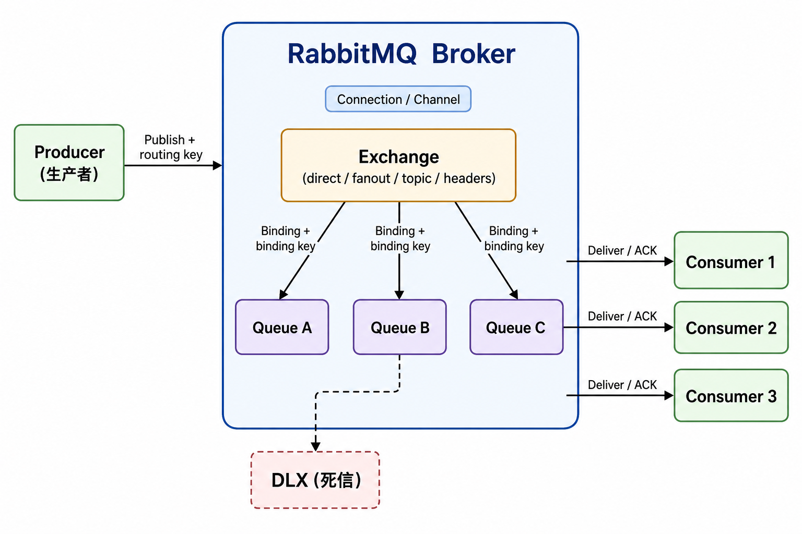

## 一、知识总览

RabbitMQ 是基于 AMQP 协议的消息中间件，核心作用是把系统之间的直接调用改造成“生产者发送消息、Broker 存储和路由、消费者异步处理”的通信模式。

面试回答时可以从四个角度展开：

- **解耦**：生产者不直接依赖消费者，服务之间通过消息契约协作。
- **异步**：非实时任务进入队列，接口可以快速返回。
- **削峰**：高峰流量先进入队列，消费者按自身能力处理。
- **可靠投递**：通过持久化、发布确认、消费确认、死信队列等机制降低消息丢失风险。

典型使用场景：

- 下单后异步发送短信、邮件、站内信。
- 电商库存扣减、订单超时关闭、支付结果通知。
- 日志采集、行为埋点、数据同步。
- 大促流量削峰，保护下游服务。
- 微服务之间的事件通知。

不适合使用 MQ 的场景：

- 必须强同步、强实时返回结果的核心链路。
- 消息顺序极其严格且吞吐要求很高的复杂场景。
- 业务无法接受重复消费，又没有幂等设计。
- 系统规模较小，引入 MQ 会明显增加运维复杂度。

### 架构示意图

下图概括生产者、Exchange、Binding、Queue 与消费者之间的典型数据流；实际部署中客户端通过 Connection / Channel 与 Broker 通信，可靠性与死信等机制见后文章节。

## 二、核心概念归纳

### 1. Producer、Consumer、Broker

- **Producer**：消息生产者，负责创建消息并发送到 Exchange。
- **Consumer**：消息消费者，从 Queue 中获取消息并执行业务逻辑。
- **Broker**：RabbitMQ 服务节点，负责接收、路由、存储和投递消息。

### 2. ConnectionFactory、Connection、Channel

- **ConnectionFactory**：创建连接的工厂。
- **Connection**：客户端与 RabbitMQ Broker 之间的 TCP 连接。
- **Channel**：建立在 Connection 之上的逻辑通道，大部分 AMQP 操作都在 Channel 上完成，包括声明 Exchange、声明 Queue、绑定关系、发布消息、消费消息等。

生产实践中通常复用 Connection，并为不同线程或不同业务操作创建独立 Channel。Channel 不是线程安全的，不建议多个线程共享同一个 Channel。

### 3. Exchange、Queue、Binding

- **Exchange**：交换机。生产者不会直接把消息发送到 Queue，而是先发送到 Exchange。
- **Queue**：队列。RabbitMQ 中消息最终存储在 Queue 中，消费者从 Queue 拉取或被推送消息。
- **Binding**：绑定关系。它把 Exchange 和 Queue 关联起来。
- **Routing key**：生产者发送消息时携带的路由键。
- **Binding key**：绑定 Exchange 和 Queue 时指定的匹配规则。

一句话总结：生产者发送消息到 Exchange，Exchange 根据类型、routing key 和 binding key 决定消息进入哪个 Queue。

### 4. Exchange 类型

#### fanout

广播模式。fanout Exchange 会把消息发送给所有绑定到该 Exchange 的 Queue，不关心 routing key。

适合场景：广播通知、缓存刷新、事件分发。

#### direct

精确匹配模式。direct Exchange 会把消息路由到 binding key 与 routing key 完全一致的 Queue。

适合场景：按业务类型精确分发，例如 `order.created`、`order.paid`。

#### topic

通配符匹配模式。topic Exchange 使用 `.` 分隔 routing key，并支持两个通配符：

- `*`：匹配一个单词。
- `#`：匹配零个或多个单词。

例如 `order.*` 可以匹配 `order.create`，但不能匹配 `order.create.success`；`order.#` 可以匹配 `order.create` 和 `order.create.success`。

适合场景：多级业务事件、日志分类、按模块和动作组合路由。

#### headers

headers Exchange 不依赖 routing key，而是根据消息 headers 中的键值对匹配。实际业务中使用较少，因为配置和排查成本较高。

## 三、消息投递流程

### 1. 基本流程

1. 生产者建立 Connection 和 Channel。
2. 生产者声明或使用已有 Exchange。
3. 生产者发送消息，并指定 routing key。
4. Exchange 根据类型和绑定规则把消息路由到一个或多个 Queue。
5. 消费者订阅 Queue。
6. RabbitMQ 将消息投递给消费者。
7. 消费者处理完成后发送 ACK。
8. RabbitMQ 收到 ACK 后从 Queue 中删除消息。

### 2. 推模式与拉模式

- **推模式**：消费者订阅队列后，RabbitMQ 主动推送消息。常用方式，吞吐更好。
- **拉模式**：消费者主动从队列获取消息。适合低频任务或特殊控制场景。

### 3. 轮询分发与公平分发

多个消费者订阅同一个 Queue 时，RabbitMQ 默认会把消息分发给不同消费者。若某些消息处理较慢，可能导致某个消费者堆积未确认消息，而其他消费者空闲。

可以通过 `prefetch count` 控制每个消费者最多持有多少条未确认消息。例如设置 `prefetch_count = 1`，表示消费者处理并 ACK 当前消息后，RabbitMQ 才继续投递下一条，从而实现更接近“能者多劳”的公平分发。

## 四、可靠性与一致性

RabbitMQ 的可靠性通常要从三个阶段考虑：

- 生产者到 Broker：消息是否成功到达 RabbitMQ。
- Broker 内部：消息是否在 RabbitMQ 宕机后仍然存在。
- Broker 到消费者：消息是否被消费者成功处理。

### 1. 生产者可靠投递

常用机制是 **Publisher Confirm**。

生产者开启 Confirm 模式后，RabbitMQ 会在消息被 Broker 接收并处理后返回确认结果：

- **ack**：消息已被 RabbitMQ 接收。
- **nack**：消息未被 RabbitMQ 正常处理，生产者需要记录失败并重试或告警。

如果消息必须路由到队列，还可以配合 **mandatory 参数** 或 Return Callback。否则消息到达 Exchange 但没有匹配 Queue 时，可能被直接丢弃。

### 2. Broker 持久化

要降低 RabbitMQ 重启导致的消息丢失，需要同时满足：

- Exchange 设置为 durable。
- Queue 设置为 durable。
- Message 设置为 persistent。

注意：持久化不等于绝对不丢。消息从内存刷盘存在时间窗口，如果 Broker 刚接收消息但还没来得及落盘就宕机，仍可能丢失。高可靠场景需要 Publisher Confirm、持久化、镜像队列或 Quorum Queue 等机制组合使用。

### 3. 消费者确认机制

消费者处理完成后发送 ACK，RabbitMQ 才会删除消息。

常见确认方式：

- **自动 ACK**：消息一投递就认为成功，消费者宕机会造成消息丢失。
- **手动 ACK**：业务处理成功后显式确认，更安全。
- **NACK / Reject**：业务处理失败时拒绝消息，可选择重新入队或丢弃。

如果消费者拿到消息后宕机，且没有发送 ACK，RabbitMQ 检测到连接断开后会把消息重新投递给其他消费者。

### 4. 重复消费与幂等

RabbitMQ 的可靠投递更接近“至少一次”，不能天然保证“只消费一次”。网络异常、消费者处理成功但 ACK 失败、生产者重试等情况都可能导致重复消息。

常见幂等方案：

- 使用业务唯一键，例如订单号、支付流水号、消息 ID。
- 消费前查询处理记录，已处理则直接 ACK。
- 数据库建立唯一索引，利用约束避免重复写入。
- Redis `SETNX` 做短期去重，但要注意过期时间和最终一致性。

### 5. 消息顺序

RabbitMQ 单队列、单消费者时较容易保证顺序。多个消费者并发消费时，处理耗时不同会导致完成顺序不一致。

如果业务强依赖顺序，可以考虑：

- 同一业务键的消息发送到同一个 Queue。
- 单 Queue 单消费者处理。
- 消费端按业务版本号或序号做校验。

代价是吞吐会下降，因此面试中要说明“顺序性”和“并发吞吐”之间存在取舍。

## 五、死信、延迟与异常处理

### 1. 死信队列

消息成为死信的常见原因：

- 消息被 `basic.reject` 或 `basic.nack` 拒绝，并且 `requeue = false`。
- 消息 TTL 过期。
- Queue 达到最大长度，旧消息被挤出。

通过给业务队列配置死信 Exchange，可以把异常消息转发到死信队列，供后续排查、补偿或人工处理。

### 2. 延迟队列

RabbitMQ 常见延迟方案：

- TTL + 死信队列：消息先进入带过期时间的队列，过期后转发到真正消费队列。
- 延迟消息插件：使用 `x-delayed-message` Exchange 实现更直观的延迟投递。

典型场景：

- 订单 30 分钟未支付自动取消。
- 延迟重试第三方接口。
- 定时检查业务状态。

TTL + 死信队列方案要注意：如果使用队列级 TTL，队头消息未过期可能阻塞后续消息；如果需要更灵活的延迟时间，插件方案通常更合适。

### 3. 重试策略

不建议消费者失败后无限重入原队列，否则会造成消息反复投递，拖垮消费者。

更稳妥的做法：

- 业务失败后记录失败原因。
- 按次数进入不同延迟队列，例如 10 秒、1 分钟、5 分钟后重试。
- 超过最大重试次数后进入死信队列。
- 对不可重试错误直接落库或告警。

## 六、性能与生产实践

### 1. prefetch count 调优

`prefetch count` 表示 RabbitMQ 在未收到 ACK 前，最多向消费者投递多少条消息。

- 设置过小：吞吐不足，消费者频繁等待。
- 设置过大：消费者内存压力增加，处理慢的消费者会积压大量未确认消息。
- 常见策略：根据单条消息处理耗时、消费者内存、业务并发能力逐步压测调整。

### 2. 消息积压排查

消息积压常见原因：

- 消费者实例数量不足。
- 消费逻辑慢，例如调用第三方接口、慢 SQL、锁竞争。
- 消费者异常退出或 ACK 逻辑缺失。
- prefetch 设置不合理。
- 下游服务故障，导致消费端持续重试。

排查思路：

1. 查看 ready、unacked、publish rate、deliver rate、ack rate。
2. 判断是生产过快、消费过慢，还是消费者异常。
3. 检查消费者日志、错误率、慢 SQL、外部接口耗时。
4. 临时扩容消费者或降级非核心生产入口。
5. 对异常消息进入死信或补偿链路，避免阻塞主队列。

### 3. 高可用

RabbitMQ 可以通过集群提升可用性。普通集群只同步元数据，不会自动复制队列消息；如果队列所在节点故障，消息可能不可用。

高可用队列常见方案：

- **Classic mirrored queue**：经典镜像队列，较老方案，维护成本较高。
- **Quorum Queue**：基于 Raft 的复制队列，更适合新版本高可靠场景。

面试中可回答：生产环境如果关注消息高可靠，优先考虑 Quorum Queue，并结合 Publisher Confirm、持久化、消费者幂等和监控告警。

### 4. RabbitMQ 与 Kafka 简要对比

- RabbitMQ 更偏业务消息、复杂路由、低延迟任务分发。
- Kafka 更偏日志流、事件流、大吞吐、可回放数据管道。
- RabbitMQ 消息消费后通常从队列删除；Kafka 消息按日志保留，消费者通过 offset 记录进度。
- RabbitMQ 路由能力更强；Kafka 在超高吞吐和流式处理上更有优势。

## 七、RabbitMQ RPC

RabbitMQ 本身主要用于异步消息处理，但也可以实现 RPC。

实现机制：

1. 客户端发送请求消息，并设置 `replyTo` 和 `correlationId`。
2. 服务端消费请求队列，处理业务逻辑。
3. 服务端把响应消息发送到 `replyTo` 指定的回调队列，并带上相同的 `correlationId`。
4. 客户端监听回调队列，根据 `correlationId` 匹配请求和响应。

RPC 模式适合同步等待处理结果的场景，但它会削弱 MQ 的异步解耦优势。生产中如果只是服务同步调用，通常优先考虑 HTTP、gRPC；只有在需要复用消息通道、跨语言解耦或异步转同步的特殊场景下再考虑 RabbitMQ RPC。

## 八、高频面试题与答案解析

### 1. RabbitMQ 的核心组件有哪些？

**答案要点：**

- Producer、Consumer、Broker。
- Connection、Channel。
- Exchange、Queue、Binding。
- routing key、binding key。

**解析：**

生产者把消息发送到 Exchange，Exchange 根据路由规则把消息投递到 Queue，消费者从 Queue 消费消息。Connection 是 TCP 连接，Channel 是基于连接的逻辑通道，实际声明队列、发布消息、消费消息通常都通过 Channel 完成。

**常见追问：**

- 为什么不直接把消息发到 Queue？
- Channel 和 Connection 有什么区别？

### 2. Exchange 有哪些类型？分别适合什么场景？

**答案要点：**

- fanout：广播到所有绑定队列。
- direct：routing key 和 binding key 精确匹配。
- topic：支持 `*` 和 `#` 的通配符匹配。
- headers：根据 headers 键值对匹配。

**解析：**

fanout 适合广播通知；direct 适合明确业务事件；topic 适合多级分类路由；headers 灵活但配置复杂，实际使用较少。回答时最好结合订单、日志、通知等业务例子。

### 3. RabbitMQ 如何保证消息不丢失？

**答案要点：**

- 生产者使用 Publisher Confirm，确认消息到达 Broker。
- Exchange、Queue、Message 都开启持久化。
- 消费者使用手动 ACK，处理成功后再确认。
- 必要时使用死信队列、重试机制和高可用队列。

**解析：**

消息丢失可能发生在三个阶段：发送阶段、Broker 存储阶段、消费阶段。单靠某一个机制不够，例如只设置消息持久化，不能保证生产者发送一定成功；只开启 ACK，也不能解决 Broker 宕机丢失。因此要分阶段回答。

### 4. ACK、NACK、Reject 分别是什么？

**答案要点：**

- ACK：消费者确认消息处理成功，RabbitMQ 删除消息。
- NACK：消费者否定确认，可批量拒绝，可选择是否重新入队。
- Reject：拒绝单条消息，可选择是否重新入队。

**解析：**

手动 ACK 是可靠消费的关键。业务处理成功后 ACK；临时失败可 NACK 并进入重试；不可恢复错误可以 reject 且不重新入队，让消息进入死信队列。不能处理失败后无限 requeue，否则可能形成死循环。

### 5. 为什么 RabbitMQ 会出现重复消费？怎么解决？

**答案要点：**

- RabbitMQ 通常保证至少一次投递，不保证绝对只投递一次。
- 消费者处理成功但 ACK 失败，消息会被重新投递。
- 生产者超时重试也可能产生重复消息。
- 解决核心是消费端幂等。

**解析：**

幂等可以通过业务唯一键、消息表、唯一索引、Redis 去重等方式实现。面试中不要只说“用 ACK 解决重复消费”，ACK 解决的是确认删除问题，不是业务幂等问题。

### 6. 如何保证消息顺序？

**答案要点：**

- 单 Queue、单 Consumer 最容易保证顺序。
- 多消费者并发会破坏处理完成顺序。
- 可以按业务键分片，让同一业务键进入同一个队列。
- 消费端可通过版本号、序号做防乱序处理。

**解析：**

顺序性和吞吐量存在冲突。真正强顺序场景要牺牲并发；如果只是同一订单内顺序，可以按订单 ID 路由到固定队列，而不是让所有消息都单线程处理。

### 7. 什么是死信队列？有什么用？

**答案要点：**

- 死信队列用于接收无法被正常消费的消息。
- 常见来源：消息被拒绝且不重新入队、消息过期、队列超长。
- 用途：异常隔离、失败补偿、人工排查、延迟队列。

**解析：**

死信队列不是单独的队列类型，而是普通队列绑定了死信 Exchange 后形成的异常处理链路。它的价值在于不让异常消息阻塞主消费流程。

### 8. RabbitMQ 如何实现延迟队列？

**答案要点：**

- TTL + 死信队列。
- 延迟消息插件 `x-delayed-message`。

**解析：**

TTL + 死信队列的思路是：消息先进入延迟队列，过期后成为死信，再被路由到真正消费队列。插件方式使用更直接，但需要安装插件。订单超时取消、延迟重试都可以用该方案。

### 9. prefetch count 是什么？为什么需要它？

**答案要点：**

- prefetch count 控制消费者未 ACK 消息的最大数量。
- 可以避免 RabbitMQ 一次性给某个消费者推送过多消息。
- 有助于实现更公平的分发和背压控制。

**解析：**

如果不限制 prefetch，慢消费者可能拿到大量消息却处理不过来，而快消费者空闲。设置合理的 prefetch 后，消费者处理完并 ACK 后才继续接收更多消息。

### 10. 消息积压怎么排查？

**答案要点：**

- 先看生产速率、消费速率、ACK 速率。
- 看 ready 和 unacked 数量判断积压位置。
- 检查消费者是否存活、是否报错、是否慢 SQL 或外部接口阻塞。
- 临时扩容消费者，必要时限流生产者。
- 对毒性消息进入死信队列，避免阻塞主队列。

**解析：**

ready 多通常表示还没投递给消费者，可能消费者不足或消费慢；unacked 多说明消息已投递但未确认，可能消费者卡住、处理慢或忘记 ACK。

### 11. RabbitMQ 如何做高可用？

**答案要点：**

- 部署 RabbitMQ 集群。
- 使用 Quorum Queue 或镜像队列复制消息。
- 生产端开启 Confirm。
- 消费端幂等处理。
- 配置监控告警和故障恢复策略。

**解析：**

普通集群并不等于消息高可用，它主要同步元数据。队列消息要通过高可用队列机制复制。新版本更推荐 Quorum Queue。

### 12. RabbitMQ 和 Kafka 有什么区别？

**答案要点：**

- RabbitMQ 偏业务消息和复杂路由。
- Kafka 偏日志流、大吞吐、可回放。
- RabbitMQ 消息被确认后通常删除。
- Kafka 消息按日志保留，消费者通过 offset 记录消费位置。

**解析：**

如果是订单通知、异步任务、复杂路由，RabbitMQ 更合适；如果是日志采集、埋点、数据管道、流式计算，Kafka 更常见。

### 13. RabbitMQ 的事务和 Publisher Confirm 有什么区别？

**答案要点：**

- 事务通过 `txSelect`、`txCommit`、`txRollback` 保证发送过程，但性能较差。
- Publisher Confirm 是异步确认机制，性能更好，生产中更常用。

**解析：**

事务会让发送链路变成同步阻塞，吞吐下降明显。Confirm 模式可以批量或异步确认，更适合高并发生产者。

### 14. 消费失败后应该怎么处理？

**答案要点：**

- 区分临时失败和永久失败。
- 临时失败进入延迟重试队列。
- 超过最大次数进入死信队列。
- 永久失败直接记录并告警。
- 消费逻辑必须保证幂等。

**解析：**

不要简单 `requeue = true` 无限重试。合理的失败处理应该有次数限制、延迟间隔、错误记录和人工补偿入口。

### 15. RabbitMQ 中 mandatory 参数有什么用？

**答案要点：**

- mandatory 用于处理消息无法路由到任何 Queue 的情况。
- 开启后，无法路由的消息会通过 Return Callback 返回给生产者。
- 未开启时，消息可能被 Exchange 直接丢弃。

**解析：**

Publisher Confirm 只能说明消息到达 Broker，不代表消息一定进入某个队列。若业务要求消息必须被路由到队列，需要结合 mandatory 或提前校验绑定关系。

## 九、面试回答模板

### 可靠性问题模板

回答 RabbitMQ 可靠性时，按“三段式”组织：

1. 生产者到 Broker：Publisher Confirm、mandatory。
2. Broker 自身：Exchange、Queue、Message 持久化，高可用队列。
3. Broker 到消费者：手动 ACK、失败重试、死信队列、消费幂等。

### 排障问题模板

回答消息积压、重复消费、消息丢失时，按“四步法”组织：

1. 先定位阶段：生产端、Broker、消费端。
2. 再看指标：ready、unacked、publish、deliver、ack。
3. 再查原因：配置、代码、下游依赖、资源瓶颈。
4. 最后给方案：扩容、限流、重试、死信、幂等、告警。

### 设计题模板

回答“如何设计一个可靠 MQ 方案”时，可以这样说：

1. 生产者发送消息前生成全局唯一 messageId，并落库记录发送状态。
2. 开启 Publisher Confirm，失败时重试或进入补偿任务。
3. Exchange、Queue、Message 开启持久化。
4. 消费端手动 ACK，业务成功后再确认。
5. 消费端基于业务唯一键保证幂等。
6. 失败消息进入延迟重试队列，超过次数进入死信队列。
7. 配置监控告警，关注堆积、未确认消息、消费失败率和节点状态。

## 十、原文参考

- RabbitMQ 入门以及使用教程：https://blog.51cto.com/u_15950441/6032111
